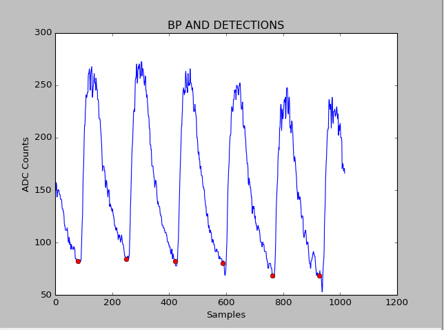
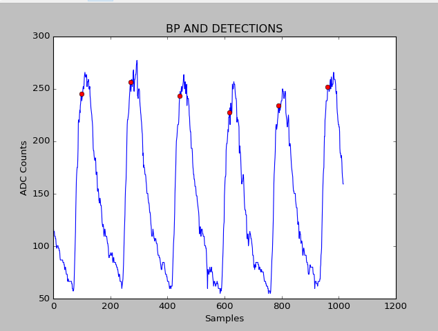

# pressure-peak-detect
A script for detecting the pressure peaks in a noisy blood pressure waveform, measured through pulse-ox, ultrasound, direct, or any other method that produces a reasonably good trace.

This script implements the algorithm described in [An Open-source Algorithm to Detect Onset of Arterial Blood Pressure Pulses](https://lcp.mit.edu/pdf/Zong03a.pdf)

The script at two primary modes of operation. It can be used to detect the onset of blood pressure peaks like so:

Altenatively it can be used to find the leftmost edge of the pressure peaks like so:

In general this script is robust in the case of arrithymia and or noisy signal. 